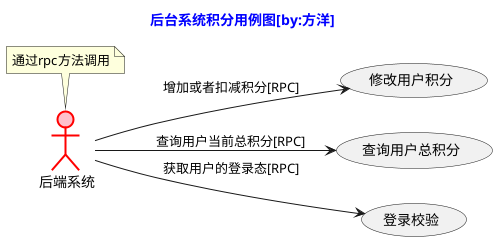

# 技术评审相关图工具

## 用例图示例

> [!note]
>
> 由VSCode、plantuml生成

``` plantuml
@startuml 积分用例图

title <font color=blue>后台系统积分用例图[by:方洋]

left to right direction

actor : 后端系统: as otherLxTaBackendService #pink;line:red;line.bold;

note top of otherLxTaBackendService
    通过rpc方法调用
end note

usecase 修改用户积分 as changeUserPoint
usecase 查询用户总积分 as getUserTotalPoint
usecase 登录校验 as getRestContextByAccessToken

otherLxTaBackendService --> getRestContextByAccessToken:获取用户的登录态[RPC]
otherLxTaBackendService --> changeUserPoint:增加或者扣减积分[RPC]
otherLxTaBackendService --> getUserTotalPoint: 查询用户当前总积分[RPC]
@enduml
```

## 时序图示例

> [!note]
>
> 由VSCode、plantuml生成

## 活动图示例

> [!note]
>
> 由VSCode、plantuml生成

## 系统架构图

> [!note]
>
> 由Processon生成

